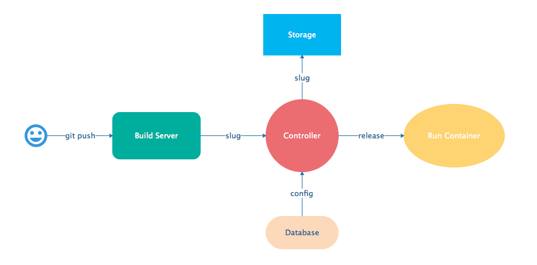
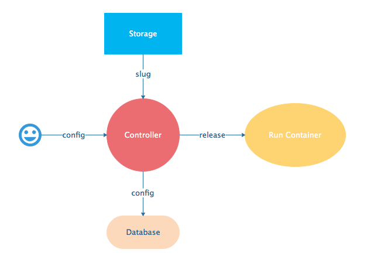

Concepts
~~~~~~~~

How Does Gigalixir Work?
========================

When you deploy an app on Gigalixir, you :bash:`git push` the source code to a build server. The build server compiles the code and assets and generates a standalone tarball we call a slug. The controller then combines the slug and your app configuration into a release. The release is deployed to run containers which actually run your app.

When you update a config, we encrypt it, store it, and combine it with the existing slug into a new release. The release is deployed to run containers.

Components
----------

  - *Build Server*: This is responsible for building your code into a release or slug.
  - *API Server / Controller*: This is responsible for handling all user requests such as scaling apps, setting configs, etc. It is also responsible for deploying the release into a run container.
  - *Database*: The database is where all of your app configuration is stored. Configs are encrypted due to their sensitive nature.
  - *Logger*: This is responsible for collecting logs from all your containers, aggregating them, and streaming them to you.
  - *Router*: This is responsible for receiving web traffic for your app, terminating TLS, and routing the traffic to your run containers.
  - *TLS Manager*: This is responsible for automatically obtaining TLS certificates and storing them.
  - *Kubernetes*: This is responsible for managing your run containers.
  - *Slug Storage*: This is where your slugs are stored.
  - *Observer*: This is an application that runs on your local machine that connects to your production node to show you everything you could ever want to know about your live production app.
  - *Run Container*: This is the container that your app runs in.
  - *Command-Line Interface*: This is the command-line tool that runs on your local machine that you use to control Gigalixir.

Concepts
--------

  - *User*: The user is you. When you sign up, we create a user.
  - *API Key*: Every user has an API Key which is used to authenticate most API requests. You get one when you login and you can regenerate it at any time. It never expires.
  - *SSH Key*: SSH keys are what we use to authenticate you when SSHing to your containers. We use them for remote observer, remote console, etc.
  - *App*: An app is your Elixir application.
  - *Release*: A release is a combination of a slug and a config which is deployed to a run container.
  - *Slug*: Each app is compiled and built into a slug. The slug is the actual code that is run in your containers. Each app will have many slugs, one for every deploy.
  - *Config*: A config is a set of key-value pairs that you use to configure your app. They are injected into your run container as environment variables.
  - *Replicas*: An app can have many replicas. A replica is a single instance of your app in a single container in a single pod.
  - *Custom Domain*: A custom domain is a fully qualified domain that you control which you can set up to point to your app.
  - *Payment Method*: Your payment method is the credit card on file you use to pay your bill each month.
  - *Permission*: A permission grants another user the ability to deploy. Even though they can deploy, you remain the owner and are responsible for paying the bill.

.. _`life of a deploy`:

Life of a Deploy
----------------

When you run :bash:`git push gigalixir`, our git server receives your source code and kicks off a build using a pre-receive hook. We build your app in an isolated docker container which ultimately produces a slug which we store for later. The buildpacks used are defined in your :bash:`.buildpacks` file.

By default, the buildpacks we use include

  - https://github.com/HashNuke/heroku-buildpack-elixir.git

    - To run mix compile
    - If you want, you can `configure this buildpack <https://github.com/HashNuke/heroku-buildpack-elixir#configuration>`_.

  - https://github.com/gjaldon/heroku-buildpack-phoenix-static.git

    - To run mix phx.digest
    - This is only included if you have an assets folder present.

  - https://github.com/gigalixir/gigalixir-buildpack-distillery.git

    - To run mix release or mix distillery.release
    - This is only run if you have a rel/config.exs file present.

  - https://github.com/gigalixir/gigalixir-buildpack-releases

    - To run mix release if you are running Elixir 1.9 and using the built-in releases
    - This is only run if you have a config/releases.exs file present. 

      .. Note:: Elixir 1.11 adds :bash:`config/runtime.exs`. If you use that instead, then you'll want to specify buildpacks since we can no longer detect if you want releases or mix mode. See :ref:`buildpacks-releases`.

  - https://github.com/gigalixir/gigalixir-buildpack-mix.git

    - To set up your Procfile correctly
    - This is only run if you *don't* have a rel/config.exs file present.

We only build the master branch and ignore other branches. When building, we cache compiled files and dependencies so you do not have to repeat the work on every deploy. We support git submodules.

Once your slug is built, we upload it to slug storage and we combine it with a config to create a new release for your app. The release is tagged with a :bash:`version` number which you can use later on if you need to rollback to this release.

Then we create or update your Kubernetes configuration to deploy the app. We create a separate Kubernetes namespace for every app, a service account, an ingress for HTTP traffic, an ingress for SSH traffic, a TLS certificate, a service, and finally a deployment which creates pods and containers.

The `container that runs your app`_ is a derivative of `heroku/cedar:14`_. The entrypoint is a script that sets up necessary environment variables including those from your :ref:`app configuration<app configuration>`. It also starts an SSH server, installs your SSH keys, downloads the current slug, and executes it. We automatically generate and set up your erlang cookie, distributed node name, and Phoenix secret key base for you. We also set up the Kubernetes permissions and libcluster selector you need to :ref:`cluster your nodes<cluster your nodes>`. We poll for your SSH keys every minute in case they have changed.

At this point, your app is running. The Kubernetes ingress controller is routing traffic from your host to the appropriate pods and terminating SSL/TLS for you automatically. For more information about how SSL/TLS works, see :ref:`how-tls-works`.

If at any point, the deploy fails, we rollback to the last known good release.

To see how we do zero-downtime deploys, see :ref:`zero-downtime`.

.. _how-tls-works:

How SSL/TLS Works
-----------------

We use cert-manager for automatic TLS certificate generation with Let's Encrypt. For more information, see `cert-manager's documentation`_. When you add a custom domain, we create a Kubernetes ingress for you to route traffic to your app. cert-manager picks this up, obtains certificates for you and installs them. Our ingress controller then handles terminating SSL traffic before sending it to your app.

.. _`cert-manager's documentation`: https://github.com/jetstack/cert-manager

.. _life-of-a-hot-upgrade:

Life of a Hot Upgrade
---------------------

There is an extra flag you can pass to deploy by hot upgrade instead of a restart. You have to make sure you bump your app version in your :bash:`mix.exs`. Distillery autogenerates your appup file, but you can supply a custom appup file if you need it. For more information, look at the `Distillery appup documentation`_.

.. code-block:: bash

    git -c http.extraheader="GIGALIXIR-HOT: true" push gigalixir

A hot upgrade follows the same steps as a regular deploy, except for a few differences. In order for distillery to build an upgrade, it needs access to your old app so we download it and make it available in the build container.

Once the slug is generated and uploaded, we execute an upgrade script on each run container instead of restarting. The upgrade script downloads the new slug, and calls `Distillery's upgrade command`_. Your app should now be upgraded in place without any downtime, dropped connections, or loss of in-memory state.

.. _`container that runs your app`: https://github.com/gigalixir/gigalixir-run
.. _`heroku/cedar:14`: https://hub.docker.com/r/heroku/cedar/
.. _`Distillery appup documentation`: https://hexdocs.pm/distillery/upgrades-and-downgrades.html#appups
.. _`Distillery's upgrade command`: https://hexdocs.pm/distillery/walkthrough.html#deploying-an-upgrade

How secure is Gigalixir?
========================

Gigalixir takes security very, very seriously.

#. Every app exists in its own Kubernetes namespaces and we use Kubernetes role-based access controls to ensure no other apps have access to your app or its metadata.
#. Your build environment is fully isolated using Docker containers.
#. Your slugs are authenticated using `Signed URLs`_.
#. All API endpoints are authenticated using API keys instead of your password. API keys can be invalidated at any time by regenerating a new one.
#. Remote console and remote observer use SSH tunnels to secure traffic.
#. Erlang does not encrypt distribution traffic between your nodes by default, but you can `set it up to use SSL`_. For an extra layer of security, we route distribution traffic directly to each node so no other apps can sniff the traffic.
#. We use `Stripe`_ to manage payment methods so Gigalixir never knows your credit card number.
#. Passwords and app configs are encrypted at rest using `Cloak`_.
#. Traffic between Gigalixir services and components is TLS encrypted.

.. _`Signed URLs`: https://cloud.google.com/storage/docs/access-control/signed-urls
.. _`Cloak`: https://github.com/danielberkompas/cloak
.. _`Stripe`: https://stripe.com/
.. _`set it up to use SSL`: http://erlang.org/doc/apps/ssl/ssl_distribution.html

Are there any benchmarks?
=========================

Take a look at our `benchmark data <https://docs.google.com/spreadsheets/d/1KWES-cSH_qXZQN9y3yu6HDSTdweIbZQuL12qLvkJnBo/edit?usp=sharing>`_.

