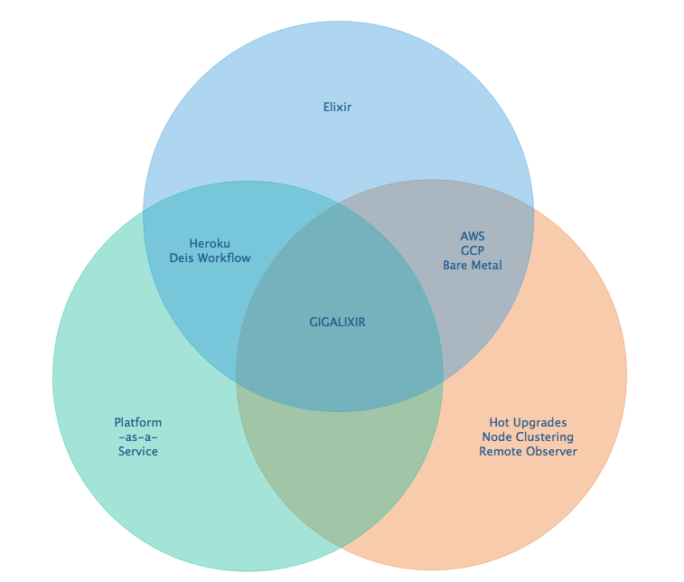

Frequently Asked Questions
~~~~~~~~~~~~~~~~~~~~~~~~~~

*What versions of Phoenix do you support?*
------------------------------------------

All versions.

*What versions of Elixir and OTP do you support?*
-------------------------------------------------

All versions of Elixir and OTP. See :ref:`configure versions`. Some buildpacks don't have the bleeding edge versions so those might not work, but they will eventually.

*Can I have multiple custom domains?*
-------------------------------------

Yes! Just follow :ref:`custom domains` for each domain.

*Do you support non-Elixir apps?*
---------------------------------

Yes, we support any language that has a buildpack, but hot upgrades, remote observer, etc probably won't work. Built-in buildpacks include

- multi
- ruby
- nodejs
- clojure
- python
- java
- gradle
- scala
- play
- php
- go
- erlang
- static

For details, see https://github.com/gliderlabs/herokuish/tree/v0.3.36/buildpacks

If the buildpack you need is not built-in, you can specify the buildpack(s) you want by listing them in a :bash:`.buildpacks` file.

For an example, see :ref:`How to deploy a Ruby app`.

*What is Elixir? What is Phoenix?*
----------------------------------

This is probably best answered by taking a look at the `elixir homepage`_ and the `phoenix homepage`_.

*How is Gigalixir different from Heroku and Deis Workflow?*
-----------------------------------------------------------

For a feature comparison table between Gigalixir and Heroku see, :ref:`gigalixir heroku feature comparison`.

Heroku is a really great platform and much of Gigalixir was designed based on their excellent `twelve-factor methodology`_. Heroku and Gigalixir are similar in that they both try to make deployment and operations as simple as possible. Elixir applications, however, aren't very much like most other apps today written in Ruby, Python, Java, etc. Elixir apps are distributed, highly-available, hot-upgradeable, and often use lots of concurrent long-lived connections. Gigalixir made many fundamental design choices that ensure all these things are possible.

For example, Heroku restarts your app every 24 hours regardless of if it is healthy or not. Elixir apps are designed to be long-lived and many use in-memory state so restarting every 24 hours sort of kills that. Heroku also limits the number of concurrent connections you can have. It also has limits to how long these connections can live. Heroku isolates each instance of your app so they cannot communicate with each other, which prevents node clustering. Heroku also restricts SSH access to your containers which makes it impossible to do hot upgrades, remote consoles, remote observers, production tracing, and a bunch of other things. The list goes on, but suffice it to say, running an Elixir app on Heroku forces you to give up a lot of the features that drew you to Elixir in the first place.

Deis Workflow is also really great platform and is very similar to Heroku, except you run it your own infrastructure. Because Deis is open source and runs on Kubernetes, you *could* make modifications to support node clustering and remote observer, but they won't work out of the box and hot upgrades would require some fundamental changes to the way Deis was designed to work. Even so, you'd still have to spend a lot of time solving problems that Gigalixir has already figured out for you.

On the other hand, Heroku and Deis are more mature products that have been around much longer. They have more features, but we are working hard to fill in the holes. Heroku and Deis also support languages other than Elixir.

For a comparison with some other hosting platforms, check out `StakNine`_'s review of the `best hosting providers for Elixir Phoenix`_.

.. _`StakNine`: https://staknine.com/?utm_source=gigalixir.com&utm_medium=referral&utm_campaign=gigalixir_docs
.. _`best hosting providers for Elixir Phoenix`: https://staknine.com/best-cloud-hosting-platforms-elixir-phoenix/?utm_source=gigalixir.com&utm_medium=referral&utm_campaign=gigalixir_docs

*I thought you weren't supposed to SSH into docker containers!?*
----------------------------------------------------------------

There are a lot of reasons not to SSH into your docker containers, but it is a tradeoff that doesn't fit that well with Elixir apps. We need to allow SSH in order to connect a remote observer to a production node, drop into a remote console, and do hot upgrades. If you don't need any of these features, then you probably don't need and probably shouldn't SSH into your containers, but it is available should you want to. Just keep in mind that full SSH access to your containers means you have almost complete freedom to do whatever you want including shoot yourself in the foot.  Any manual changes you make during an SSH session will also be wiped out if the container restarts itself so use SSH with care.

*Why do you download the slug on startup instead of including the slug in the Docker image?*
--------------------------------------------------------------------------------------------

Great question! The short answer is that after a hot-upgrade, if the container restarts, you end
up reverting back to the slug included in the container. By downloading the slug on startup,
we can always be sure to pull the most current slug even after a hot upgrade.

This sort of flies in the face of a lot of advice about how to use Docker, but it is a tradeoff
we felt was necessary in order to support hot upgrades in a containerized environment. The
non-immutability of the containers can cause problems, but over time we've ironed them out and
feel that there is no longer much downside to this approach. All the headaches that came as a
result of this decision are our responsibility to address and shouldn't affect you as a customer.
In other words, you reap the benefits while we pay the cost, which is one of the ways we provide value.

*How do I add worker processes?*
--------------------------------

Heroku and others allow you to specify different types of processes under a single app such as workers that pull work from a queue. With Elixir, that is rarely needed since you can spawn asynchronous tasks within your application itself. Elixir and OTP provide all the tools you need to do this type of stuff among others. For more information, see `Background Jobs in Phoenix`_ which is an excellent blog post. If you really need to run an Redis-backed queue to process jobs, take a look at Exq, but consider `whether you really need Exq`_.

.. _`Background Jobs in Phoenix`: http://blog.danielberkompas.com/2016/04/05/background-jobs-in-phoenix.html
.. _`whether you really need Exq`: https://github.com/akira/exq#do-you-need-exq

*My git push was rejected*
--------------------------

Try force pushing with

.. code-block:: bash

    git push -f gigalixir

.. _`elixir homepage`: http://elixir-lang.org/
.. _`phoenix homepage`: http://www.phoenixframework.org/
.. _`twelve-factor methodology`: https://12factor.net/
